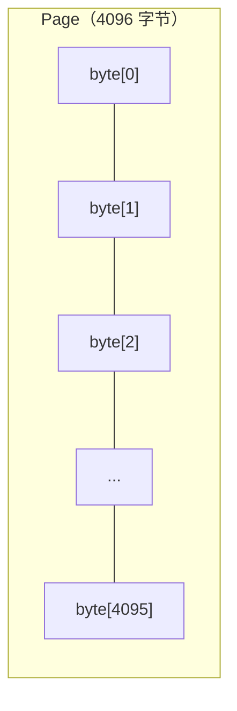
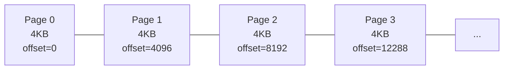
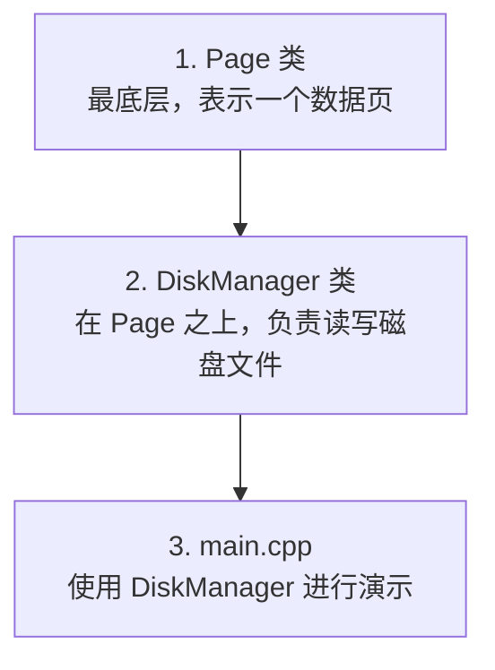
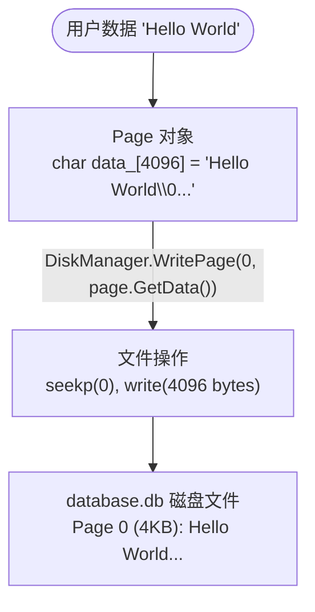

# Lesson 01 — 存储引擎基础：Page 与 DiskManager

> **本课目标**：理解数据库如何将数据组织成"页面"并管理磁盘文件。
> 你将从零开始写出两个核心类：`Page`（页面）和 `DiskManager`（磁盘管理器）。

---

## 第一步：理解问题——数据库为什么需要"页面"？

### 1.1 磁盘读写的基本单位

操作系统读写磁盘不是"一个字节一个字节"的，而是按 **块（Block）** 来的，通常一个块是 512 字节或 4KB。

如果你要读第 100 个字节，磁盘实际上会把包含第 100 个字节的那一整块 4KB 全部读出来。

**所以数据库的设计思路是**：既然磁盘每次最少读 4KB，那我就把数据也按 4KB 为单位来组织。这样一次磁盘 I/O 就能恰好读到一个完整的"数据页"。

### 1.2 什么是 Page（页面）



### 1.3 数据库文件的结构

数据库在磁盘上就是一个普通文件，但它的内容被划分成等大的 Page：



计算公式：`offset = page_id × PAGE_SIZE`

每个 Page 有一个编号（page_id），通过编号可以直接算出它在文件中的偏移量。这种设计叫做**堆文件（Heap File）**。

### 1.4 为什么不直接用文件存 JSON 或 CSV？

| 问题 | CSV/JSON | Page 方案 |
|------|----------|-----------|
| 随机读取某条记录 | 必须从头扫描 | 通过 page_id 直接跳转 |
| 修改某条记录 | 需要重写整个文件 | 只重写一个 4KB 页面 |
| 性能 | O(n) | O(1) 定位到页面 |

---

## 第二步：确定编码顺序

写代码要有顺序，先写底层，再写上层：



**为什么这个顺序？**
- `DiskManager` 需要操作 `Page`，所以 `Page` 必须先定义
- `main.cpp` 是用户代码，调用 `DiskManager` 的接口，所以最后写
- 这是**自底向上**的开发方式：先把基础组件写好、测试好，再组合它们

---

## 第三步：编写 Page 类

### 3.1 设计思路

Page 类只需要回答几个问题：
1. 这个页面是谁？（page_id）
2. 页面里存了什么数据？（data 字节数组）
3. 数据有没有被修改过？（is_dirty 脏标记）

### 3.2 代码详解

**page.h**

```cpp
#pragma once
#include <cstdint>
#include <cstring>

// 页面大小：4096 字节（4KB）
// 为什么是 4096？因为这是大多数操作系统和磁盘的 I/O 块大小
// 对齐磁盘块大小，一次 I/O 恰好读写一个 Page
static constexpr size_t PAGE_SIZE = 4096;

// 无效页面 ID，用于初始化和错误标记
static constexpr int32_t INVALID_PAGE_ID = -1;

// page_id_t 是页面编号的类型别名
// 用 int32_t，支持约 21 亿个页面 × 4KB ≈ 8TB 数据库文件
using page_id_t = int32_t;
```

**为什么用 `static constexpr` 而不是 `#define`？**
- `#define` 是预处理器宏，没有类型检查，调试时看不到
- `constexpr` 是真正的常量，有类型，编译器能优化

```cpp
class Page {
public:
    Page() : page_id_(INVALID_PAGE_ID), is_dirty_(false) {
        // 构造时将数据区清零
        // memset 比 for 循环快得多，因为编译器会优化为 SIMD 指令
        memset(data_, 0, PAGE_SIZE);
    }

    // --- Getter/Setter ---

    page_id_t GetPageId() const { return page_id_; }
    void SetPageId(page_id_t id) { page_id_ = id; }

    // GetData() 返回指向内部数据的指针
    // 上层代码通过这个指针读写页面内容
    char* GetData() { return data_; }
    const char* GetData() const { return data_; }

    // 脏标记：页面被修改后设为 true
    // "脏"意味着内存中的数据和磁盘上的不一致
    // 后续需要把脏页写回磁盘（称为"刷盘" flush）
    bool IsDirty() const { return is_dirty_; }
    void SetDirty(bool dirty) { is_dirty_ = dirty; }

    // 重置页面状态（用于复用页面）
    void Reset() {
        page_id_ = INVALID_PAGE_ID;
        is_dirty_ = false;
        memset(data_, 0, PAGE_SIZE);
    }

private:
    page_id_t page_id_;   // 页面编号
    bool      is_dirty_;  // 是否被修改（脏页标记）
    char      data_[PAGE_SIZE]; // 实际数据，固定大小 4096 字节
};
```

**为什么 data_ 放在最后？**
- C++ 对象在内存中的布局是按声明顺序的
- `data_` 是一个 4096 字节的数组，放在最后方便调试时查看
- `page_id_` 和 `is_dirty_` 是元数据，放在前面更直观

**为什么用 `char data_[]` 而不是 `vector<char>`？**
- Page 大小是固定的（4096 字节），不需要动态增长
- 数组直接嵌入对象内存中，没有额外的堆分配开销
- 数据库系统中 Page 通常在内存池中连续排列，用数组更高效

---

## 第四步：编写 DiskManager 类

### 4.1 设计思路

DiskManager 需要做的事情：
1. **打开/创建**数据库文件
2. **写入**指定页面到文件的对应位置
3. **读取**指定页面从文件的对应位置
4. **分配**新的页面 ID
5. **统计**页面总数

### 4.2 核心公式

```
第 N 个页面在文件中的偏移量 = N × PAGE_SIZE

写入 Page 3：
  offset = 3 × 4096 = 12288
  seek 到 offset 12288，写入 4096 字节

读取 Page 3：
  offset = 3 × 4096 = 12288
  seek 到 offset 12288，读取 4096 字节
```

### 4.3 代码详解

**disk_manager.h**

```cpp
class DiskManager {
public:
    explicit DiskManager(const std::string& db_file);
    ~DiskManager();

    // 写入页面：将 page 的数据写入文件的对应位置
    void WritePage(page_id_t page_id, const char* page_data);

    // 读取页面：从文件的对应位置读取数据到 page_data
    void ReadPage(page_id_t page_id, char* page_data);

    // 分配一个新页面 ID（简单递增）
    page_id_t AllocatePage();

    // 获取页面总数
    int GetPageCount() const { return next_page_id_; }

private:
    std::string file_name_;     // 数据库文件名
    std::fstream db_file_;      // 文件流（读写）
    page_id_t next_page_id_;   // 下一个可分配的页面 ID
};
```

**为什么构造函数用 `explicit`？**
- 防止编译器做隐式类型转换：`DiskManager mgr = "test.db"` 会被阻止
- 避免难以发现的 bug

**disk_manager.cpp 核心逻辑**

```cpp
// 构造函数：打开或创建数据库文件
DiskManager::DiskManager(const std::string& db_file)
    : next_page_id_(0), file_name_(db_file) {

    // 先尝试以读写方式打开已有文件
    db_file_.open(db_file, std::ios::in | std::ios::out | std::ios::binary);
    if (!db_file_.is_open()) {
        // 文件不存在，先创建它
        db_file_.open(db_file, std::ios::out | std::ios::binary);
        db_file_.close();
        // 重新以读写方式打开
        db_file_.open(db_file, std::ios::in | std::ios::out | std::ios::binary);
    }

    // 从文件大小推算已有的页面数量
    db_file_.seekg(0, std::ios::end);
    int file_size = db_file_.tellg();
    next_page_id_ = file_size / PAGE_SIZE;
}
```

**为什么需要从文件大小推算页面数？**
- 数据库重启后，需要知道文件里已经有多少页面
- `file_size / PAGE_SIZE` 就是已有页面的数量
- 这样 `next_page_id_` 就从正确的位置继续分配

```cpp
void DiskManager::WritePage(page_id_t page_id, const char* page_data) {
    // 1. 计算偏移量
    size_t offset = static_cast<size_t>(page_id) * PAGE_SIZE;

    // 2. 定位到文件中的位置
    db_file_.seekp(offset, std::ios::beg);

    // 3. 写入 PAGE_SIZE 字节
    db_file_.write(page_data, PAGE_SIZE);

    // 4. 刷新缓冲区，确保数据真正写到磁盘
    //    如果不 flush，数据可能还在操作系统缓冲区中
    //    断电就会丢失
    db_file_.flush();
}
```

**为什么写入后要 `flush()`？**
- 操作系统也有自己的文件缓冲区
- `write()` 之后数据可能还在 OS 缓冲区，没有真正落盘
- `flush()` 确保（或至少提示 OS）将数据写入物理磁盘
- 数据库系统需要保证数据不丢失

```cpp
void DiskManager::ReadPage(page_id_t page_id, char* page_data) {
    // 安全检查：page_id 必须在有效范围内
    if (page_id < 0 || page_id >= next_page_id_) {
        // 超出范围的页面，返回零页面
        memset(page_data, 0, PAGE_SIZE);
        return;
    }

    size_t offset = static_cast<size_t>(page_id) * PAGE_SIZE;
    db_file_.seekg(offset, std::ios::beg);
    db_file_.read(page_data, PAGE_SIZE);

    // 如果读取失败（文件末尾等），清零
    if (db_file_.fail()) {
        db_file_.clear();
        memset(page_data, 0, PAGE_SIZE);
    }
}
```

**为什么需要检查 `fail()`？**
- 读取可能因为各种原因失败（文件损坏、并发访问等）
- 数据库系统的原则：宁可返回空数据，也不能崩溃

### 4.4 整体数据流



---

## 第五步：编写 main.cpp 演示

main.cpp 的目的是验证我们写的代码能正常工作：

1. 创建 DiskManager，打开数据库文件
2. 分配页面并写入数据
3. 读取数据验证正确性
4. 打印统计信息

**运行结果**：

```
=== Lesson 01: 存储引擎基础 ===

--- 创建 DiskManager ---
[DiskManager] 打开数据库文件: lesson01.db
当前页面数: 0

--- 写入页面 ---
写入 Page 0: "Lesson 01 - Page Zero: Hello, Database!"
写入 Page 1: "Lesson 01 - Page One: B+ Tree coming next"
写入 Page 2: "Lesson 01 - Page Two: Buffer Pool Manager"

--- 读取验证 ---
读取 Page 0: "Lesson 01 - Page Zero: Hello, Database!"  ✓ 一致
读取 Page 1: "Lesson 01 - Page One: B+ Tree coming next"  ✓ 一致
读取 Page 2: "Lesson 01 - Page Two: Buffer Pool Manager"  ✓ 一致

--- 统计信息 ---
数据库文件: lesson01.db
总页面数: 3
```

---

## 第六步：编译运行

```bash
cd /home/aoi/AWorkSpace/sql_mvp/build
cmake ..
make lesson01
./lesson01_storage/lesson01
```

---

## 本课知识点总结

**你学到了：**

概念层：
- 数据库用"页面"（Page）作为数据管理的最小单位
- 页面大小对齐磁盘 I/O 块大小（4KB）
- 数据库文件 = N 个 Page 首尾相连
- 通过 `page_id × PAGE_SIZE` 可以直接定位到文件的任意位置

代码层：
- `Page` 类：封装数据 + 元数据（page_id, is_dirty）
- `DiskManager` 类：管理磁盘文件的读写
- 文件操作：open/seek/read/write/flush
- 错误处理：文件不存在时创建，读取失败时清零

设计思想：
- 自底向上开发：先 Page → 再 DiskManager → 最后 main
- 固定大小设计：Page 大小固定，简化计算和管理
- 脏标记机制：后续缓冲池会用到

---

## 思考题

1. **如果 page_id 从 0 开始递增，删除一个页面后，ID 会出现"空洞"。怎么处理？**
   <details><summary>提示</summary>真实数据库用空闲链表（Free List）或位图（Bitmap）来跟踪哪些页面被删除了。我们的 MVP 使用简单递增，跳过这个问题。</details>

2. **为什么 `memset(data_, 0, PAGE_SIZE)` 而不是循环赋值？**
   <details><summary>提示</summary>memset 是 C 标准库函数，编译器会优化为 SIMD 指令（如 x86 的 rep stosb），比循环快得多。</details>

3. **如果两个线程同时 WritePage 同一个 page_id 会怎样？**
   <details><summary>提示</summary>数据竞争（Data Race），需要加锁。本课是单线程的，Lesson 02 会遇到并发问题。</details>

---

## 下一课预告

Lesson 02 将实现**缓冲池（Buffer Pool）**：在内存中缓存热点页面，避免每次都访问磁盘。这是数据库性能的关键。
