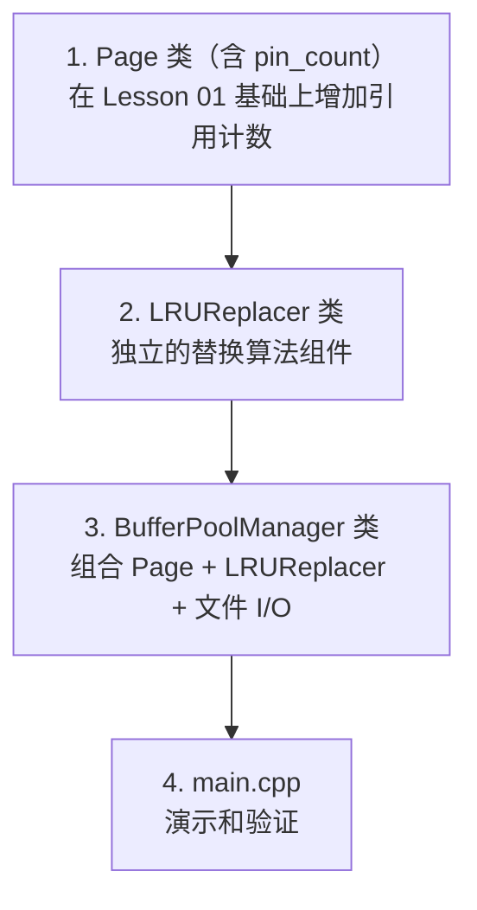
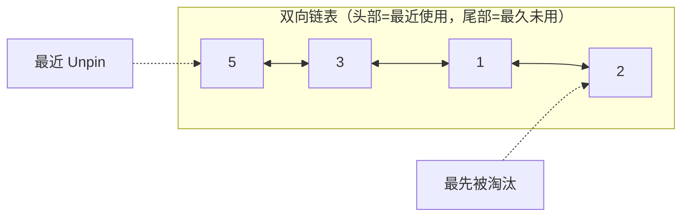
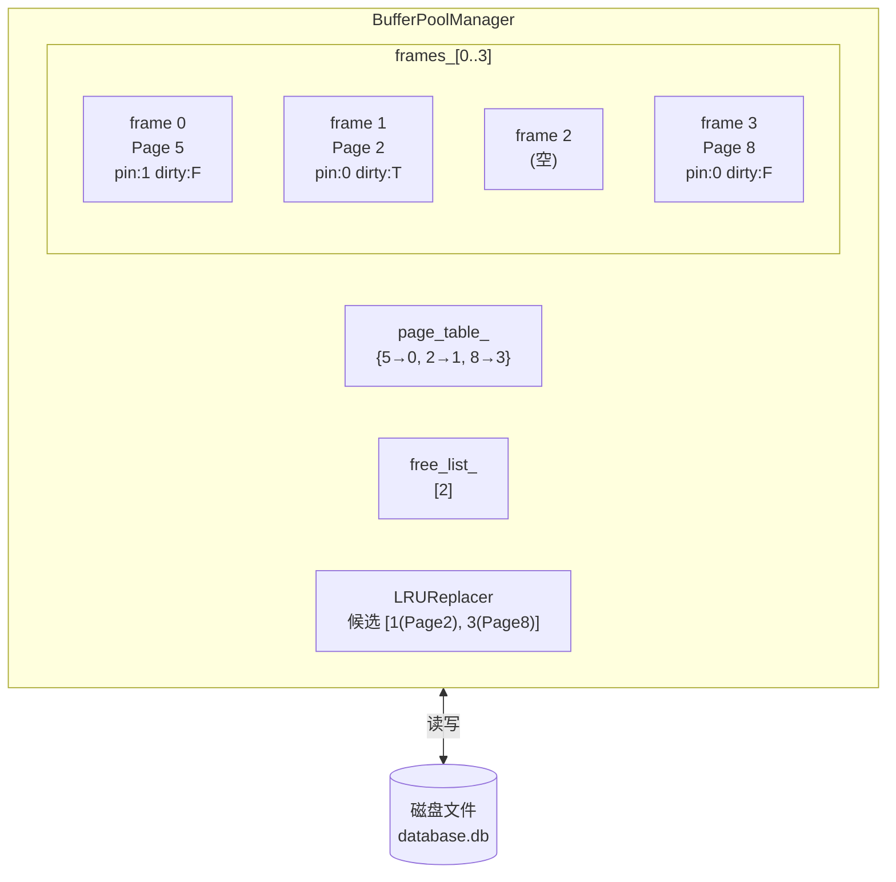
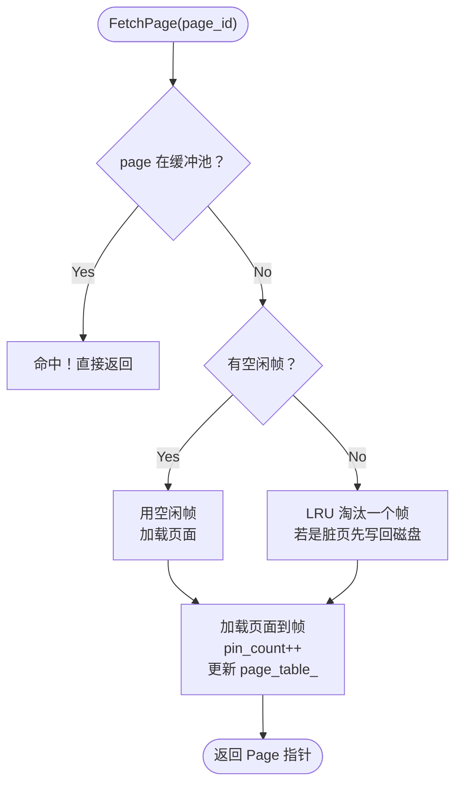

# Lesson 02 — 缓冲池管理：LRU 替换与 BufferPoolManager

> **本课目标**：理解为什么需要缓冲池，实现 LRU 替换算法，构建 BufferPoolManager。
> 你将写出两个核心类：`LRUReplacer`（替换器）和 `BufferPoolManager`（缓冲池管理器）。

---

## 第一步：理解问题——为什么不能每次都读写磁盘？

### 1.1 磁盘 vs 内存的速度差距

```
访问方式       延迟             相对速度
─────────────────────────────────────────
L1 缓存       ~1 ns            1x
L2 缓存       ~4 ns            4x
内存 (DRAM)    ~100 ns          100x
SSD           ~100,000 ns      100,000x
机械硬盘       ~10,000,000 ns   10,000,000x
```

磁盘比内存慢 **10 万到 1000 万倍**！如果每次读数据都访问磁盘，数据库的性能会灾难性地差。

### 1.2 缓冲池的核心思想

```
没有缓冲池：
  每次 SELECT → 读磁盘 → 超慢

有缓冲池：
  第 1 次 SELECT → 读磁盘 → 数据放入缓冲池 → 返回
  第 2 次 SELECT → 缓冲池命中 → 直接返回（快 10 万倍！）
  第 N 次 SELECT → 缓冲池命中 → 直接返回
```

**核心问题**：内存是有限的，缓冲池满了怎么办？

**答案**：把最久没用的页面淘汰掉，腾出空间给新页面。这就是 **LRU（Least Recently Used）** 算法。

---

## 第二步：确定编码顺序



**为什么 LRUReplacer 要独立出来？**
- **单一职责原则**：替换策略是独立的算法，应该和缓冲池管理分开
- **可替换性**：未来如果你想换用 Clock、LFU 等算法，只需替换 Replacer
- **可测试性**：可以单独测试 LRU 算法的正确性

---

## 第三步：编写 LRUReplacer

### 3.1 算法原理

LRU 用**双向链表 + 哈希表**实现 O(1) 操作：



哈希表：`{ 5→节点5位置, 3→节点3位置, 1→节点1位置, 2→节点2位置 }`

操作示例：
- `Unpin(4)` → 加入链表头部 → `[4→5→3→1→2]`
- `Pin(3)` → 从链表移除 → `[4→5→1→2]`
- `Victim()` → 取出尾部 `2` → `[4→5→1]`，返回 `2`

### 3.2 为什么要双向链表 + 哈希表？

| 操作 | 只用链表 | 链表 + 哈希表 |
|------|---------|-------------|
| Pin(frame_id) | O(n) 遍历查找 | O(1) 哈希查找 |
| Unpin(frame_id) | O(n) 检查是否已存在 | O(1) 哈希检查 |
| Victim() | O(1) 取尾部 | O(1) 取尾部 |

### 3.3 代码详解

**lru_replacer.h**

```cpp
class LRUReplacer {
public:
    explicit LRUReplacer(size_t pool_size);
    ~LRUReplacer() = default;

    // 淘汰最久未用的帧
    bool Victim(frame_id_t* frame_id);

    // 固定某帧（正在使用，不能淘汰）
    void Pin(frame_id_t frame_id);

    // 解固某帧（使用完毕，可以被淘汰）
    void Unpin(frame_id_t frame_id);

    size_t Size() const;

private:
    size_t pool_size_;
    std::list<frame_id_t> lru_list_;  // 双向链表
    // 哈希表：frame_id → 链表中的迭代器（位置）
    std::unordered_map<frame_id_t, std::list<frame_id_t>::iterator> lru_map_;
};
```

**为什么用 `std::list` 而不是手写双向链表？**
- `std::list` 就是双向链表，且**迭代器不会失效**（除非删除该节点）
- 这意味着我们可以安全地把迭代器存在哈希表中
- `std::vector` 的迭代器会在扩容时失效，不适合这里

**lru_replacer.cpp 逐函数解析**

```cpp
bool LRUReplacer::Victim(frame_id_t* frame_id) {
    if (lru_list_.empty()) {
        return false;  // 没有可淘汰的帧
    }

    // 关键：从链表尾部取（最久未用的）
    *frame_id = lru_list_.back();
    lru_map_.erase(*frame_id);    // 同步删除哈希表条目
    lru_list_.pop_back();          // 从链表移除
    return true;
}
```

**为什么从尾部取而不是头部？**
- 我们的约定：**头部 = 最近使用，尾部 = 最久未用**
- LRU 要淘汰的是"最久没用"的，所以取尾部
- 这个约定可以反过来，关键是 Pin/Unpin/Victim 要一致

```cpp
void LRUReplacer::Pin(frame_id_t frame_id) {
    // Pin 表示"这个帧正在被使用，不能淘汰"
    auto it = lru_map_.find(frame_id);
    if (it != lru_map_.end()) {
        lru_list_.erase(it->second);  // 从链表移除
        lru_map_.erase(it);           // 从哈希表移除
    }
    // 如果不在列表中，说明已经 Pin 过了，什么都不做
}
```

```cpp
void LRUReplacer::Unpin(frame_id_t frame_id) {
    // 防止重复添加
    if (lru_map_.count(frame_id) > 0) {
        return;  // 已在列表中
    }
    // 加入链表头部（标记为"最近使用"）
    lru_list_.push_front(frame_id);
    lru_map_[frame_id] = lru_list_.begin();  // 记录位置
}
```

**为什么 Unpin 加入头部？**
- Unpin 表示"这个帧刚使用完毕"
- 它是"最近使用"的，应该放在头部
- 下次淘汰时，它会被留在最后才淘汰

---

## 第四步：编写 BufferPoolManager

### 4.1 整体架构



### 4.2 核心数据结构

```cpp
class BufferPoolManager {
private:
    size_t pool_size_;                                      // 帧数量
    std::vector<Page> frames_;                              // 帧数组（每个是一个 Page）
    std::unordered_map<page_id_t, frame_id_t> page_table_;  // page_id → frame_id 映射
    std::list<frame_id_t> free_list_;                       // 空闲帧列表
    LRUReplacer replacer_;                                  // LRU 替换器
    page_id_t next_page_id_;                                // 下一个可分配的 page_id
    std::string db_file_name_;                              // 数据库文件名
    std::fstream db_file_;                                  // 文件流
};
```

**page_table_ 的作用：**
```
问题：给定 page_id，如何快速知道它是否在缓冲池中？在哪个帧？
答案：page_table_ 是一个哈希表，page_id → frame_id，O(1) 查找

例子：
  page_table_ = {5→0, 2→1, 8→3}

  FetchPage(5)：
    查 page_table_，找到 {5→0}
    返回 &frames_[0]  ← 缓存命中！

  FetchPage(3)：
    查 page_table_，没找到
    需要从磁盘加载 ← 缓存未命中
```

### 4.3 FetchPage 流程详解

这是缓冲池最核心的函数：



### 4.4 Pin/Unpin 机制详解

```
Pin 计数（引用计数）确保"正在使用的页面不会被淘汰"：

时间线：
  t1: FetchPage(5)     → pin_count=1, 从LRU中移除
  t2: 读取 Page 5 数据  （安全，因为 pin_count > 0）
  t3: UnpinPage(5)     → pin_count=0, 加入LRU候选列表
  t4: 此时 Page 5 可以被淘汰了

如果跳过 Unpin：
  Page 5 的 pin_count 永远 > 0
  → 永远不能被淘汰
  → 缓冲池逐渐被"钉死"的页面占满
  → 这叫做"内存泄漏"（数据库版本）
```

### 4.5 代码关键片段

```cpp
Page* BufferPoolManager::FetchPage(page_id_t page_id) {
    // 1. 缓存命中检查
    auto it = page_table_.find(page_id);
    if (it != page_table_.end()) {
        frame_id_t frame_id = it->second;
        frames_[frame_id].IncrPinCount();  // pin_count++
        replacer_.Pin(frame_id);            // 从LRU移除
        return &frames_[frame_id];          // 直接返回
    }

    // 2. 缓存未命中 → 找一个可用帧
    frame_id_t frame_id = GetAvailableFrame();
    if (frame_id == -1) return nullptr;     // 池满，所有帧都被pin

    // 3. 从磁盘加载到帧
    frames_[frame_id].Reset();              // 清空帧
    LoadPageFromDisk(page_id, frame_id);     // 读磁盘
    frames_[frame_id].SetPageId(page_id);
    frames_[frame_id].IncrPinCount();       // pin_count=1

    // 4. 更新映射
    page_table_[page_id] = frame_id;
    replacer_.Pin(frame_id);

    return &frames_[frame_id];
}
```

```cpp
frame_id_t BufferPoolManager::GetAvailableFrame() {
    // 优先使用空闲帧
    if (!free_list_.empty()) {
        frame_id_t f = free_list_.front();
        free_list_.pop_front();
        return f;
    }

    // 没有空闲帧 → LRU 淘汰
    frame_id_t victim_frame;
    if (!replacer_.Victim(&victim_frame)) {
        return -1;  // 所有帧都被 pin 住
    }

    // 被淘汰的帧如果是脏页，必须先写回磁盘！
    Page& victim = frames_[victim_frame];
    if (victim.IsDirty()) {
        WritePageToDisk(victim_frame);
    }

    // 从映射中移除旧页面
    page_table_.erase(victim.GetPageId());
    return victim_frame;
}
```

**为什么脏页淘汰前必须写回磁盘？**
- 脏页 = 内存中被修改过，但磁盘上还是旧数据
- 如果直接丢弃脏页，修改就丢失了
- 必须先写回磁盘（flush），再淘汰

---

## 第五步：main.cpp 演示

程序演示了：
1. **LRU 替换器的工作**：Pin/Unpin/Victim 的行为
2. **缓冲池的缓存命中**：第二次读取同一页面时命中
3. **页面淘汰**：缓冲池只有 3 帧，放入第 4 页时触发 LRU 淘汰
4. **磁盘读取**：被淘汰的页面再次访问时从磁盘重新加载

**运行结果**（关键部分）：

```
=== Lesson 02: 缓冲池管理 ===

======= LRU 替换器演示 =======
Unpin 帧 1,2,3,4,5，可淘汰数量: 5
Pin 帧 1,3 后，可淘汰数量: 3
淘汰帧: 2（最久未用）
淘汰帧: 4

======= 缓冲池管理器演示 =======
[BufferPoolManager] 新建页面 page_id=0 → frame_id=0
[BufferPoolManager] 新建页面 page_id=1 → frame_id=1
[BufferPoolManager] 新建页面 page_id=2 → frame_id=2
[BufferPoolManager] 淘汰脏页 0，已写回磁盘   ← LRU 淘汰！
[BufferPoolManager] 新建页面 page_id=3 → frame_id=0

--- 重新获取被淘汰的页面（从磁盘加载）---
[BufferPoolManager] 从磁盘加载 page_id=0 → frame_id=1
```

---

## 编译运行

```bash
cd /home/aoi/AWorkSpace/sql_mvp/build
cmake ..
make lesson02
./lesson02_buffer_pool/lesson02
```

---

## 本课知识点总结

**你学到了：**

概念层：
- 缓冲池：内存中的页面缓存，减少磁盘 I/O
- LRU 算法：淘汰最久未使用的页面
- Pin/Unpin：引用计数机制，保护正在使用的页面
- 脏页：被修改的页面，淘汰前必须写回磁盘

数据结构：
- 双向链表 + 哈希表 = O(1) 的 LRU 实现
- `page_table_`：page_id → frame_id 的哈希映射
- `free_list_`：空闲帧链表

设计模式：
- 策略模式：替换算法独立为 Replacer，可替换
- 缓存模式：缓存命中 → 直接返回；未命中 → 加载到缓存
- 引用计数：pin_count 管理页面的生命周期

---

## 思考题

1. **全表扫描时，LRU 会把所有热点数据挤出缓冲池（叫做"缓存污染"）。怎么解决？**
   <details><summary>提示</summary>MySQL 用改进的 LRU：将链表分为 young 区和 old 区，新加入的页面先放 old 区，被再次访问才提升到 young 区。</details>

2. **如果所有帧都被 pin 住，FetchPage 会返回 nullptr。真实数据库是怎么处理这种情况的？**
   <details><summary>提示</summary>真实数据库会让当前线程等待（阻塞），直到某个帧被 Unpin。可以用条件变量实现。</details>

3. **BufferPoolManager 的析构函数为什么必须 FlushAllPages？**
   <details><summary>提示</summary>如果不刷盘，脏页的数据只存在于内存中。程序退出后内存释放，数据就丢失了。</details>

---

## 下一课预告

Lesson 03 将实现 **B+ 树索引**：数据库最常用的索引结构，支持 O(log n) 的查找、插入和删除。
