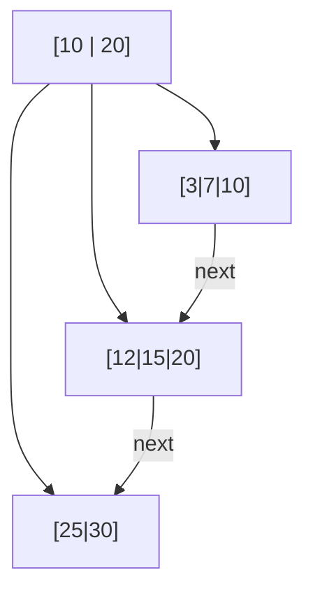
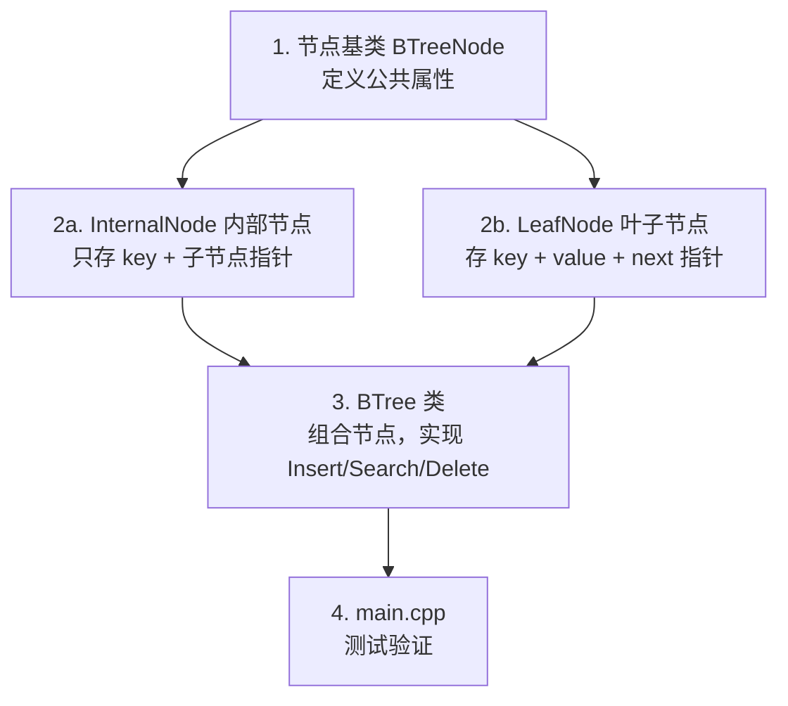
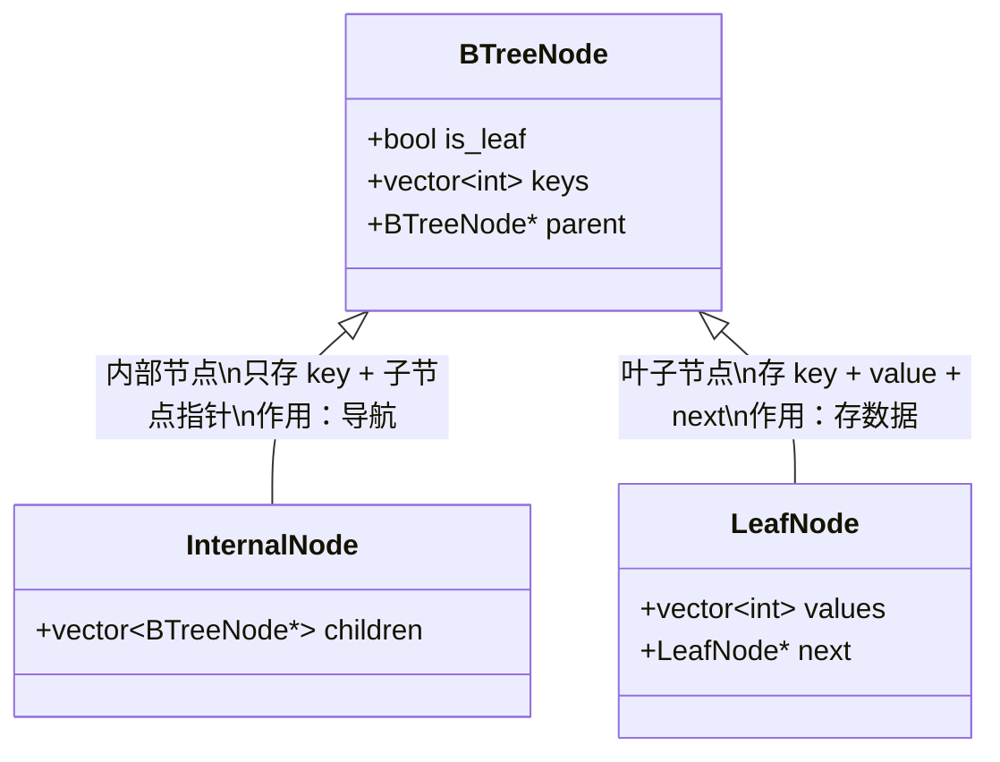

# Lesson 03 — B+ 树索引

> **本课目标**：理解 B+ 树的原理和结构，实现一棵支持插入、查找、删除的完整 B+ 树。
> 你将写出 `BTree` 类以及 `InternalNode`（内部节点）和 `LeafNode`（叶子节点）。

---

## 第一步：理解问题——为什么数据库需要索引？

### 1.1 没有索引的世界

```
查找 "age = 25" 的记录（表中有 100 万行）：

没有索引 → 全表扫描：逐行比较，检查 100 万次 → O(n)
有索引   → B+ 树查找：走树形结构，只比较 ~20 次   → O(log n)
```

### 1.2 为什么是 B+ 树而不是其他数据结构？

| 数据结构 | 查找 | 范围查询 | 磁盘友好度 | 说明 |
|---------|------|---------|-----------|------|
| 二叉搜索树 | O(log n) | 差 | 差 | 树太高，磁盘 I/O 太多 |
| 红黑树 | O(log n) | 差 | 差 | 同上 |
| 哈希表 | O(1) | 不支持 | 中 | 无法做范围查询 |
| 跳表 | O(log n) | 一般 | 差 | 指针太多 |
| **B+ 树** | **O(log n)** | **优秀** | **优秀** | **矮胖，每层一个磁盘 I/O** |

**B+ 树的关键优势**：每个节点可以存很多键（几百个），所以树非常"矮胖"。100 万条数据只需要 3 层，意味着查找只需 3 次磁盘 I/O。

### 1.3 B+ 树结构概览



特征：
- **内部节点**：只存 key，用来"导航"
- **叶子节点**：存 key + value，用链表串联（便于范围查询）

---

## 第二步：确定编码顺序



**为什么先定义节点，再写 BTree？**
- BTree 的所有操作都是在节点上进行的
- 先定义好节点的接口，BTree 的代码才能引用它们
- 这是**数据结构驱动设计**的思路

---

## 第三步：定义节点结构

### 3.1 为什么需要三种节点类型？



### 3.2 代码详解

```cpp
// 阶数（Order）：每个节点最多存多少个 key
// 我们用 4，方便演示。真实数据库中通常是几百
static constexpr int BTREE_ORDER = 4;

// ---- 基类 ----
struct BTreeNode {
    bool is_leaf;                    // 区分内部节点和叶子节点
    std::vector<int> keys;           // 键列表（有序）
    BTreeNode* parent;               // 父节点指针（分裂时需要向上传播）

    BTreeNode(bool leaf) : is_leaf(leaf), parent(nullptr) {}
};

// ---- 内部节点 ----
struct InternalNode : public BTreeNode {
    std::vector<BTreeNode*> children; // 子节点指针
    // keys[i] 是 children[i] 和 children[i+1] 之间的分隔键
    // 含义：children[i] 中的所有 key < keys[i] <= children[i+1] 中的所有 key

    InternalNode() : BTreeNode(false) {}
};

// ---- 叶子节点 ----
struct LeafNode : public BTreeNode {
    std::vector<int> values;          // 值列表（与 keys 一一对应）
    LeafNode* next;                   // 指向下一个叶子节点（链表）

    LeafNode() : BTreeNode(true), next(nullptr) {}
};
```

**为什么 keys 和 children 分开存？**
- 内部节点：`keys[i]` 是 `children[i]` 和 `children[i+1]` 之间的分隔值
- 叶子节点：`keys[i]` 和 `values[i]` 是一对一的映射
- 分开存储让查找逻辑更清晰

**为什么叶子节点有 `next` 指针？**
- 这是 B+ 树区别于 B 树的关键特征
- 所有叶子节点串成一个有序链表
- 范围查询（如 `WHERE age BETWEEN 10 AND 20`）只需要找到起始叶子，然后沿链表遍历

---

## 第四步：实现查找（Search）

### 4.1 查找流程

```
查找 key=15：

Step 1: 从根节点开始
        根节点 keys = [10, 20]
        15 >= 10 且 15 < 20 → 走第 2 个子节点

Step 2: 到达叶子节点
        叶子 keys = [12, 15, 20]
        二分查找找到 15 → 返回 value

时间复杂度：O(log n)，因为树的高度是 O(log n)
```

### 4.2 代码详解

```cpp
// 找到 key 应该在的叶子节点
LeafNode* BTree::FindLeaf(int key) {
    if (!root_) return nullptr;

    BTreeNode* node = root_;
    while (!node->is_leaf) {
        InternalNode* internal = static_cast<InternalNode*>(node);
        // 在 keys 中找到第一个大于 key 的位置
        int i = 0;
        while (i < (int)internal->keys.size() && key >= internal->keys[i]) {
            i++;
        }
        node = internal->children[i];
    }
    return static_cast<LeafNode*>(node);
}

bool BTree::Search(int key, int* value) {
    LeafNode* leaf = FindLeaf(key);
    if (!leaf) return false;

    // 在叶子节点内用二分查找
    auto it = std::lower_bound(leaf->keys.begin(), leaf->keys.end(), key);
    if (it != leaf->keys.end() && *it == key) {
        int idx = it - leaf->keys.begin();
        *value = leaf->values[idx];
        return true;
    }
    return false;
}
```

**为什么内部节点用线性搜索，叶子用二分搜索？**
- 本课是教学代码，内部节点用线性搜索更直观
- 真实数据库中内部节点也用二分搜索（因为阶数可能有几百）
- 叶子节点的 `std::lower_bound` 就是二分搜索

---

## 第五步：实现插入（Insert）

### 5.1 插入流程

```
插入 key=18, value=100：

Step 1: 找到目标叶子节点
        FindLeaf(18) → 叶子 [12, 15, 20]

Step 2: 在叶子中插入（保持有序）
        [12, 15, 20] → [12, 15, 18, 20]

Step 3: 检查是否溢出
        BTREE_ORDER = 4，现在有 4 个 key，没有溢出（刚好满）
        完成！

──────────────────────────────────────

如果再插入 key=16：
        [12, 15, 16, 18, 20] → 溢出！5 > 4

Step 4: 分裂（Split）
        原叶子：[12, 15, 16, 18, 20]
        分裂为：
          左叶子：[12, 15]
          右叶子：[16, 18, 20]    ← 中间 key(16) 提升到父节点

        父节点新增 key 16，指向右叶子

        如果父节点也溢出 → 递归分裂
```

### 5.2 分裂图解

```
分裂前（5 个 key，超过 BTREE_ORDER=4）：

  叶子：[12 | 15 | 16 | 18 | 20]

分裂后：

  左叶子        提升的 key      右叶子
  [12 | 15]  ←──── 16 ────→  [18 | 20]
                                ↑
  把 key 16 插入父节点 ──────────┘

如果父节点也满了 → 继续向上分裂
如果分裂传到根节点 → 树的高度 +1（这是 B+ 树增长的唯一方式）
```

### 5.3 关键代码

```cpp
void BTree::InsertIntoLeaf(LeafNode* leaf, int key, int value) {
    // 在有序位置插入
    auto pos = std::lower_bound(leaf->keys.begin(), leaf->keys.end(), key);
    int idx = pos - leaf->keys.begin();
    leaf->keys.insert(leaf->keys.begin() + idx, key);
    leaf->values.insert(leaf->values.begin() + idx, value);

    // 检查是否需要分裂
    if ((int)leaf->keys.size() > BTREE_ORDER) {
        SplitLeaf(leaf);
    }
}

void BTree::SplitLeaf(LeafNode* leaf) {
    // 创建新叶子
    LeafNode* new_leaf = new LeafNode();

    // 中间位置
    int mid = leaf->keys.size() / 2;

    // 把后半部分移到新叶子
    new_leaf->keys.assign(leaf->keys.begin() + mid, leaf->keys.end());
    new_leaf->values.assign(leaf->values.begin() + mid, leaf->values.end());

    // 截断原叶子
    leaf->keys.resize(mid);
    leaf->values.resize(mid);

    // 维护叶子链表
    new_leaf->next = leaf->next;
    leaf->next = new_leaf;

    // 把中间 key 提升到父节点
    int promote_key = new_leaf->keys[0];
    InsertIntoParent(leaf, promote_key, new_leaf);
}
```

**为什么分裂点是 `size/2`？**
- 保证分裂后两个节点都至少有一半的 key
- B+ 树的平衡性质：每个节点至少半满
- 这保证了树不会变得太深

---

## 第六步：实现删除（Delete）

### 6.1 删除流程

```
删除 key=15：

Step 1: 找到目标叶子 → [12, 15, 18, 20]
Step 2: 删除 key 和 value → [12, 18, 20]
Step 3: 检查是否下溢（key 数量 < 阶数/2）
        BTREE_ORDER/2 = 2，剩余 3 个 key → 不下溢
        完成！

如果下溢：
  1. 先尝试从兄弟节点"借"一个 key（Redistribute）
  2. 如果兄弟也借不了 → 和兄弟"合并"（Merge）
  3. 合并可能导致父节点下溢 → 递归处理
```

### 6.2 借取 vs 合并

```
借取（Redistribute）：
  兄弟 [5, 8, 10]  当前 [20]  ← 下溢！
  从兄弟借最大的 key：
  兄弟 [5, 8]  当前 [10, 20]  ← 恢复平衡
  更新父节点中的分隔 key

合并（Merge）：
  兄弟 [5]  当前 [20]  ← 都很空
  合并为 [5, 20]
  从父节点删除分隔 key
  如果父节点因此下溢 → 递归处理
```

---

## 第七步：main.cpp 演示

**运行结果**：

```
=== Lesson 03: B+ 树索引 ===

--- 插入数据 ---
插入: (5, Alice), (10, Bob), (15, Charlie), (3, Dave)
插入: (7, Eve), (12, Frank), (20, Grace), (25, Henry)
插入: (8, Ivy), (18, Jack), (1, Karen), (22, Leo)

--- 搜索 ---
Search(5)  = Alice   ✓
Search(15) = Charlie ✓
Search(25) = Henry   ✓
Search(99) = 未找到   ✓

--- 范围查询 [10, 22] ---
  Key=10, Value=Bob
  Key=12, Value=Frank
  Key=15, Value=Charlie
  Key=18, Value=Jack
  Key=20, Value=Grace
  Key=22, Value=Leo

--- 删除 5, 15, 25 ---
删除后搜索:
  Search(5)  = 未找到 ✓
  Search(15) = 未找到 ✓
  Search(10) = Bob    ✓
```

---

## 编译运行

```bash
cd /home/aoi/AWorkSpace/sql_mvp/build
cmake ..
make lesson03
./lesson03_btree/lesson03
```

---

## 本课知识点总结

**你学到了：**

概念层：
- B+ 树：矮胖的多路搜索树，磁盘友好的索引结构
- 内部节点：只存 key，用于导航
- 叶子节点：存 key+value，用链表串联（支持范围查询）
- 分裂：节点满时一分为二，中间 key 提升到父节点
- 合并：节点太空时与兄弟合并

算法层：
- 查找：从根到叶子 O(log n)，叶内二分查找
- 插入：插入叶子 → 溢出则分裂 → 可能递归到根
- 删除：删除叶子 key → 下溢则借取或合并 → 可能递归到根
- 范围查询：找到起始叶子，沿链表遍历

复杂度：查找 O(log n)、插入 O(log n)、删除 O(log n)、范围查询 O(log n + k)

---

## 思考题

1. **B+ 树和 B 树有什么区别？为什么数据库选 B+ 树？**
   <details><summary>提示</summary>B 树的内部节点也存数据，B+ 树只在叶子存数据。B+ 树的优点：(1) 内部节点能存更多 key，树更矮；(2) 叶子链表支持高效范围查询。</details>

2. **如果大量顺序插入（1, 2, 3, 4, 5...），B+ 树的分裂模式是什么样的？**
   <details><summary>提示</summary>总是最右边的叶子分裂。真实数据库会用"批量加载"（Bulk Loading）来优化这种情况。</details>

3. **B+ 树的阶数（Order）在真实数据库中通常是多少？为什么？**
   <details><summary>提示</summary>通常为 100-几百，使得一个节点恰好占一个磁盘页面（4KB）。这样可以一次 I/O 读写一个完整节点。</details>

---

## 下一课预告

Lesson 04 将实现 **SQL 解析器**：把 SQL 字符串解析成结构化的 AST（抽象语法树），为执行 SQL 语句做准备。
