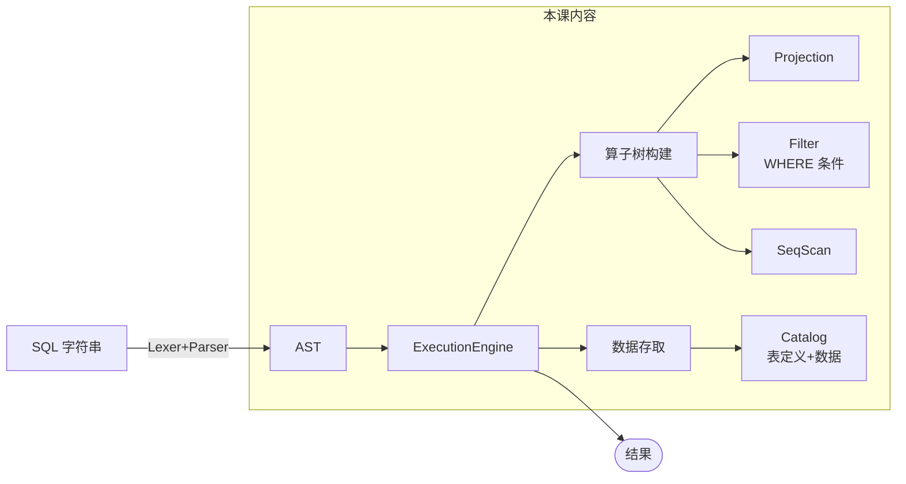
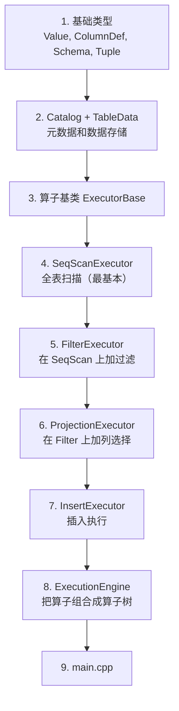
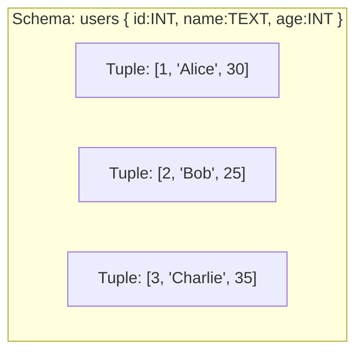
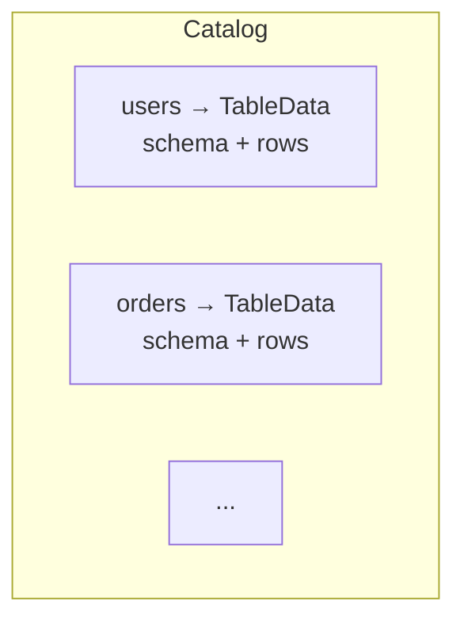
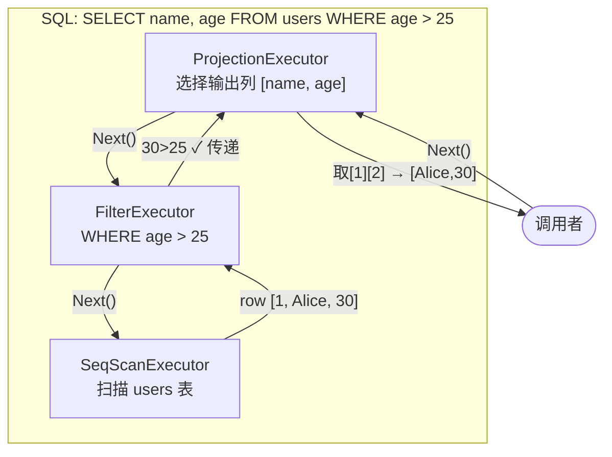

# Lesson 05 — 查询执行器：火山模型

> **本课目标**：理解数据库查询执行的经典模型——火山模型（Volcano Model），
> 实现基本算子和执行引擎，将查询请求转化为实际的数据操作。
> 你将写出 `Catalog`（元数据管理）、多个 `Executor`（算子）和 `ExecutionEngine`（执行引擎）。

---

## 第一步：理解问题——SQL 解析之后，谁来执行？

### 1.1 查询执行的全流程



Lesson 04 产出了 AST，本课要把 AST 变成可以执行的算子。

### 1.2 什么是火山模型？

火山模型（又叫迭代模型）是数据库查询执行的经典方案：

```
每个算子只有三个接口：
  Init()   → 初始化
  Next()   → 返回下一行数据（返回空表示结束）
  Close()  → 清理

上层算子通过调用下层算子的 Next() 来"拉取"数据。
数据像火山喷发一样，从底层算子"涌"向顶层。
```

**为什么叫"火山"？**
- 数据从底部（表扫描）往上"喷发"
- 每个算子是一个"层"，只关心自己的逻辑
- 上层不需要知道下层的实现细节

---

## 第二步：确定编码顺序



**为什么先写 SeqScan，再写 Filter，最后写 Projection？**
- SeqScan 是最底层的算子（数据源），其他算子依赖它
- Filter 包裹 SeqScan，在数据上应用过滤条件
- Projection 包裹 Filter，选择输出的列
- 这是一个从简单到复杂、从底层到上层的过程

---

## 第三步：定义基础类型

### 3.1 数据类型

```cpp
// 值类型：一行中某一列的值
// 用 variant 表示"可以是整数，也可以是字符串"
using Value = std::variant<int64_t, std::string>;

// 为什么用 variant 而不是 union？
// - variant 是类型安全的，知道当前存的是哪种类型
// - union 是类型不安全的，程序员要自己记住当前类型
// - C++17 的 variant 是现代 C++ 的推荐做法
```

### 3.2 表结构定义

```cpp
// 列定义
struct ColumnDef {
    std::string name;   // 列名：如 "id", "name"
    std::string type;   // 类型："INT" 或 "TEXT"
};

// Schema（表结构）
struct Schema {
    std::string table_name;           // 表名
    std::vector<ColumnDef> columns;   // 列定义列表

    // 根据列名找到列的索引位置
    int GetColumnIndex(const std::string& col_name) const {
        for (int i = 0; i < (int)columns.size(); i++) {
            if (columns[i].name == col_name) return i;
        }
        return -1;  // 不存在
    }
};

// Tuple（一行数据）
// 每个元素对应 Schema 中的一列
// 例如 Schema 是 {id:INT, name:TEXT, age:INT}
// Tuple = {Int(1), Str("Alice"), Int(30)}
using Tuple = std::vector<Value>;
```

**为什么 Schema 和 Tuple 分开？**
- Schema 是"类型信息"（表有几列，每列什么类型）
- Tuple 是"数据"（一行的实际值）
- 多个 Tuple 共享同一个 Schema，节省内存

### 3.3 类型关系图



---

## 第四步：实现 Catalog

### 4.1 Catalog 的角色



### 4.2 代码详解

```cpp
struct TableData {
    Schema schema;             // 表结构
    std::vector<Tuple> rows;   // 所有行数据（本课用内存存储）

    void InsertRow(const Tuple& row) {
        // 类型检查：行数据的列数必须和 schema 一致
        if (row.size() != schema.columns.size()) {
            throw std::runtime_error("列数不匹配");
        }
        rows.push_back(row);
    }
};

class Catalog {
public:
    void CreateTable(const Schema& schema);
    void DropTable(const std::string& table_name);
    TableData* GetTable(const std::string& table_name);
    bool TableExists(const std::string& table_name) const;
    std::vector<std::string> ListTables() const;

private:
    std::unordered_map<std::string, TableData> tables_;
    // key = 表名, value = 表数据
};
```

**为什么用 `unordered_map` 而不是 `map`？**
- `unordered_map` 基于哈希表，查找 O(1)
- `map` 基于红黑树，查找 O(log n)
- 表名查找不需要有序，用哈希表更快

---

## 第五步：实现算子（Executor）

### 5.1 算子基类

```cpp
class ExecutorBase {
public:
    virtual ~ExecutorBase() = default;
    virtual void Init() = 0;
    virtual std::optional<Tuple> Next() = 0;  // 返回下一行，空表示结束
    virtual const Schema& GetOutputSchema() const = 0;
};
```

**为什么用 `std::optional<Tuple>` 而不是返回指针？**
- `optional` 明确表达"可能有值，也可能没有"
- 不需要检查 `nullptr`，更安全
- C++17 的推荐做法

### 5.2 SeqScanExecutor（全表扫描）

```
功能：逐行扫描表中的所有数据

SeqScanExecutor
  ↓ Init(): cursor = 0
  ↓ Next():
       if cursor < rows.size()
         return rows[cursor++]
       else
         return nullopt

数据流：
  Table: [row0, row1, row2, row3, row4]
                  ↓
  Next() → row0
  Next() → row1
  Next() → row2
  ...
  Next() → nullopt（结束）
```

```cpp
class SeqScanExecutor : public ExecutorBase {
public:
    explicit SeqScanExecutor(const TableData* table)
        : table_(table), cursor_(0) {}

    void Init() override { cursor_ = 0; }

    std::optional<Tuple> Next() override {
        if (!table_ || cursor_ >= table_->rows.size()) {
            return std::nullopt;
        }
        return table_->rows[cursor_++];
    }

    const Schema& GetOutputSchema() const override {
        return table_->schema;
    }

private:
    const TableData* table_;
    size_t cursor_;
};
```

### 5.3 FilterExecutor（过滤）

```
功能：从子算子拉取数据，只返回满足条件的行

调用链：
  FilterExecutor.Next()
    │
    ├→ child_.Next() → row1 → 检查条件 → 不满足 → 继续
    ├→ child_.Next() → row2 → 检查条件 → 满足 → 返回 row2
    ├→ child_.Next() → row3 → 检查条件 → 不满足 → 继续
    └→ child_.Next() → nullopt → 返回 nullopt
```

```cpp
class FilterExecutor : public ExecutorBase {
public:
    FilterExecutor(std::unique_ptr<ExecutorBase> child, Predicate predicate)
        : child_(std::move(child)), predicate_(std::move(predicate)) {}

    void Init() override { child_->Init(); }

    std::optional<Tuple> Next() override {
        while (true) {
            auto row = child_->Next();
            if (!row.has_value()) return std::nullopt;
            if (predicate_(*row, child_->GetOutputSchema())) {
                return row;  // 满足条件，返回
            }
            // 不满足，继续拉取
        }
    }

private:
    std::unique_ptr<ExecutorBase> child_;  // 子算子
    Predicate predicate_;                   // 过滤条件
};
```

**为什么用 `std::unique_ptr` 管理子算子？**
- 算子树是独占所有权：一个子算子只有一个父算子
- `unique_ptr` 自动释放内存，不会泄漏
- 表达"唯一拥有"的语义

### 5.4 ProjectionExecutor（投影）

```
功能：选择特定的列输出

输入行：[1, "Alice", 30]（3列）
选择列：["name", "age"]
输出行：["Alice", 30]（2列）

实现：
  找到 name 在 schema 中的索引 = 1
  找到 age 在 schema 中的索引 = 2
  对每一行，只取 [1] 和 [2] 位置的值
```

### 5.5 算子树的构建



---

## 第六步：实现 ExecutionEngine

### 6.1 ExecutionEngine 的角色

```
ExecutionEngine 是"总指挥"：
  1. 接收 SQL 请求（简化版，本课不用 AST）
  2. 查 Catalog 获取表信息
  3. 构建算子树
  4. 执行算子树
  5. 返回结果
```

### 6.2 ExecuteSelect 的核心逻辑

```cpp
std::vector<Tuple> ExecutionEngine::ExecuteSelect(const SimpleSelect& sel) {
    // 1. 从 Catalog 获取表
    TableData* table = catalog_->GetTable(sel.table);

    // 2. 构建算子树（从底向上）
    // 底层：全表扫描
    auto exec = std::make_unique<SeqScanExecutor>(table);

    // 中层：过滤（如果有 WHERE）
    if (sel.where.has_value()) {
        Predicate pred = BuildPredicate(*sel.where);
        exec = std::make_unique<FilterExecutor>(std::move(exec), pred);
    }

    // 上层：投影
    exec = std::make_unique<ProjectionExecutor>(std::move(exec), sel.columns);

    // 3. 执行：逐行拉取
    exec->Init();
    std::vector<Tuple> result;
    while (auto row = exec->Next()) {
        result.push_back(*row);
    }
    return result;
}
```

**为什么用 `std::move` 包裹算子？**
- `unique_ptr` 不能复制，只能移动
- `std::move` 表示"我把这个算子的所有权转移给你"
- 这是构建算子链的标准模式

---

## 第七步：main.cpp 演示

**运行结果**：

```
=== Lesson 05: 查询执行器（火山模型）===

--- CREATE TABLE users ---
表 users 创建成功

--- INSERT INTO users ---
插入: 1, Alice, 30
插入: 2, Bob, 25
插入: 3, Charlie, 35
插入: 4, Dave, 28
插入: 5, Eve, 22

--- SELECT * FROM users ---
id             name           age
--------------------------------------------
1              Alice          30
2              Bob            25
3              Charlie        35
4              Dave           28
5              Eve            22
(5 行)

--- SELECT * FROM users WHERE age > 27 ---
id             name           age
--------------------------------------------
1              Alice          30
3              Charlie        35
4              Dave           28
(3 行)

--- SELECT name, age FROM users WHERE id = 3 ---
name           age
------------------------------
Charlie        35
(1 行)
```

---

## 编译运行

```bash
cd /home/aoi/AWorkSpace/sql_mvp/build
cmake ..
make lesson05
./lesson05_executor/lesson05
```

---

## 本课知识点总结

**你学到了：**

架构模式：
- 火山模型：每个算子有 Init/Next/Close 接口
- 拉取模型：上层通过 Next() 从下层拉取数据
- 算子组合：算子可以像积木一样自由组合

代码结构：
- Catalog：管理表的元数据和数据
- SeqScanExecutor：全表扫描
- FilterExecutor：WHERE 条件过滤
- ProjectionExecutor：SELECT 列选择
- InsertExecutor：INSERT 执行
- ExecutionEngine：构建和执行算子树

设计思想：
- 策略模式：不同算子实现统一接口
- 组合模式：算子可以嵌套组合
- 关注点分离：每个算子只做一件事

---

## 思考题

1. **火山模型的 Next() 每次只返回一行，虚函数调用开销大。批量模型（Vectorized Model）如何优化？**
   <details><summary>提示</summary>每次 Next() 返回一批行（如 1024 行），减少虚函数调用次数。现代分析型数据库（如 ClickHouse、DuckDB）都用批量模型。</details>

2. **如何支持 ORDER BY？需要什么样的算子？**
   <details><summary>提示</summary>SortExecutor：先把所有数据从子算子拉取到内存中，然后排序，再逐行返回。这是一个"阻塞算子"——必须等所有数据到齐才能输出。</details>

3. **如何支持 JOIN？需要什么样的算子？**
   <details><summary>提示</summary>NestedLoopJoinExecutor：两个子算子（左表和右表），对左表每行，扫描右表找匹配行。更高效的是 HashJoin：先构建哈希表，再探测。</details>

---

## 下一课预告

Lesson 06 将把前 5 课的所有组件**整合**成一个完整的数据库 MVP，支持交互式 SQL 和数据持久化。
